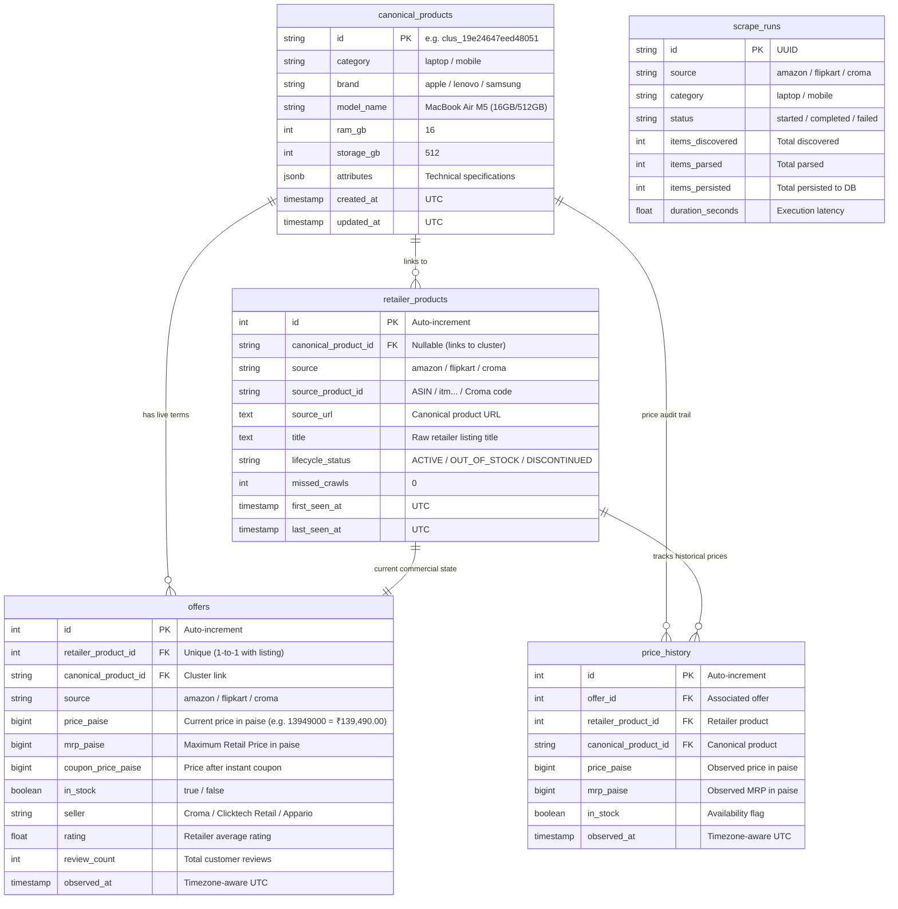
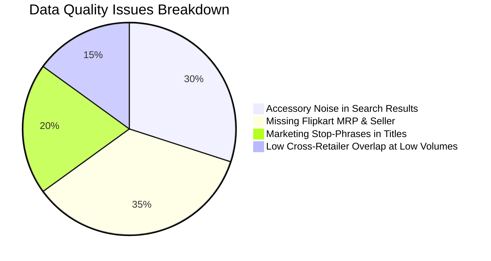
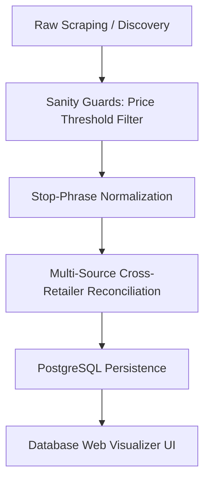

# Certikart Pipeline: Database Architecture & Data Quality Analysis

This document provides a comprehensive breakdown of the PostgreSQL database tables, an audit of live data collected across Amazon, Flipkart, and Croma, identified data quality gaps, and an engineering improvement roadmap.

---

## 1. Database Schema & Table Architecture

The pipeline persists data into 5 core relational tables designed for deterministic variant matching, lifecycle tracking, and price auditing.



---

## 2. Table-by-Table Reference

| Table Name | Entity Role | Key Columns | Why It Exists |
|---|---|---|---|
| **`canonical_products`** | **Master Product Cluster** | `id`, `category`, `brand`, `model_name`, `ram_gb`, `storage_gb`, `attributes` | Single source of truth for an exact physical hardware variant across all retailers. |
| **`retailer_products`** | **Retailer Listing** | `id`, `source`, `source_product_id`, `source_url`, `lifecycle_status` | Represents a raw catalog item on Amazon, Flipkart, or Croma. Prevents duplicate scraping. |
| **`offers`** | **Active Commercial Terms** | `price_paise`, `mrp_paise`, `in_stock`, `seller`, `rating`, `review_count` | Powers instant price comparison (Which retailer is cheapest right now?). |
| **`price_history`** | **Append-Only Audit Log** | `offer_id`, `price_paise`, `mrp_paise`, `observed_at` | Powers "30-Day Lowest Price" badges, price drop alerts, and price trend charts. |
| **`scrape_runs`** | **Operational Telemetry** | `source`, `category`, `status`, `items_persisted`, `duration_seconds` | Crawler health monitoring, throughput metrics, and failure diagnostics. |

---

## 3. Live Data Audit (Collected Data Analysis)

An audit was performed on live records collected from Amazon, Flipkart, and Croma in PostgreSQL.

### Current Database Metrics
- **Canonical Products**: `24`
- **Retailer Listings**: `24`
- **Active Offers**: `24`
- **Price History Records**: `34`

### What is Working Exceptionally Well:
1. **Integer Paise Precision**: All money fields use integer paise (`BigInteger`), eliminating floating-point rounding bugs.
2. **Croma Rich Specification Extraction**: Croma extraction yields over 50 structured attributes including Manufacturer Part Number (`mdhe4hn/a`), EAN/GTIN (`195950690132`), battery technology, Wi-Fi 7, and screen resolutions.
3. **Deterministic Category Handlers**: Apple M-series, AMD Ryzen, Intel Core Ultra, and Snapdragon processors are accurately categorized into their respective product families.

---

### Data Quality Gaps Identified:



### Detailed Problem Log:

#### 1. Accessory Noise in Search Queries
- **Observed**: Amazon search for "laptop" ingested an accessory item (`Shopper's Cloud™` laptop stand/sleeve at `₹899.00`).
- **Root Cause**: Keyword search on retailers occasionally returns high-relevance accessories even if the keyword filter excludes words like "case" or "sleeve".
- **Solution**: Add category-level minimum price sanity filters (e.g., Laptops < ₹12,000 or Mobiles < ₹3,000 flagged as accessories).

#### 2. Flipkart MRP & Seller Missing
- **Observed**: Flipkart listings showed `MRP: ₹0.00` and `Seller: None`.
- **Root Cause**: Flipkart uses modern dynamic DOM classes (`yRaY8j` / `_3I9_wc`) for strike-through prices and `#sellerName` for seller identities.
- **Solution**: Update Flipkart parser selectors to extract MRP and seller name.

#### 3. Marketing Stop-Phrases in Model Names
- **Observed**: Titles contain trailing marketing fluff like `"Online at Best Price on Flipkart"` or `"(Includes extra discount on exchange)"`.
- **Solution**: Strip standard retailer suffix boilerplate during normalization.

#### 4. Cross-Retailer Cluster Linking Rate
- **Observed**: In small test crawls (5 products per source), retailers ranked different laptops on their search front page, yielding single-source clusters.
- **Solution**: High-volume runs (`--limit 80` or `make scrape-all`) or category seed lists ensure identical SKUs are discovered across all 3 retailers.

---

## 4. Actionable Improvement Roadmap



### Improvement Tasks:
1. **Category Minimum Price Guards**:
   - `laptop`: Reject/flag products below ₹10,000.
   - `mobile`: Reject/flag products below ₹2,500.
2. **Parser Refinements**:
   - Add Flipkart strike-through MRP selector and seller name extractor.
   - Add Amazon strike-through original price parser.
3. **Title Cleaner Pipeline**:
   - Strip `"Online at Best Price..."` and promotional phrases.
4. **High-Volume Crawl Orchestration**:
   - Run `make bulk-collect` with limit 80 across all categories.

---

## 5. Web Visualizer Access

The Database Visualizer Web UI is integrated into `compose.dev.yml`:

- **URL**: [http://localhost:8081](http://localhost:8081)
- **Command to Launch**:
  ```bash
  make db-ui
  ```
- **Features**: Visual table explorer, JSON attribute tree inspector, live SQL runner, CSV/JSON export.
