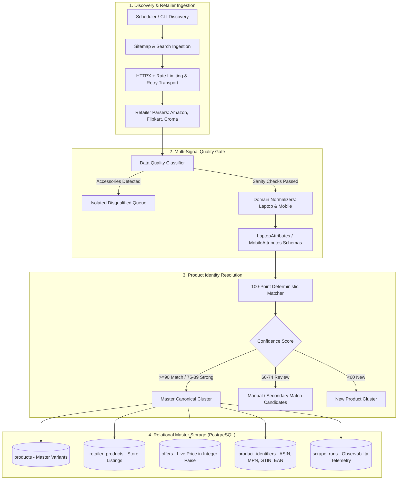
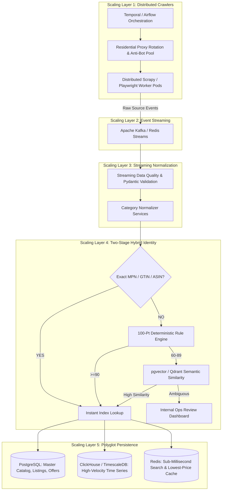

# Certikart Pipeline: Production Architecture & System Roadmap 🚀

> **System Positioning Statement**:
> *"A production-oriented e-commerce product ingestion and price-comparison pipeline with deterministic product identity resolution, data-quality gates, retailer-specific extraction, and PostgreSQL persistence with global hardware identity indexing. The architecture is designed to evolve toward distributed crawling, event streaming, semantic matching, and dedicated analytical storage as volume increases."*

---

## 1. Implemented Architecture (Current System State)

The current implementation is structured around a solid, type-safe, and auditable foundation designed for correctness and deterministic clustering.



### What is Active & Verified in Code Today
- **PostgreSQL 5-Table Relational Schema**:
  - `products`: Master hardware product clusters with normalized specifications.
  - `retailer_products`: Store-specific product pages with lifecycle tracking and data quality scores.
  - `offers`: Live commercial state (price in integer paise, MRP, coupon discount, seller, stock, ratings).
  - `product_identifiers`: Normalized external hardware identifiers (`ASIN`, `MPN`, `GTIN`, `EAN`) with unique index `(identifier_type, identifier_value)`.
  - `scrape_runs`: Telemetry logs for crawl execution, duration latency, and parser health.
- **Domain Identity Normalizers & Pydantic Schemas**:
  - `LaptopIdentityNormalizer` / `LaptopAttributes`: Processor extraction (M1–M5 Pro/Max, A18 Pro, Intel Core Ultra, AMD Ryzen AI, Snapdragon X, MediaTek), RAM type (Unified Memory, LPDDR5X, DDR5), display panel (Liquid Retina XDR, OLED, 4K UHD), GPU VRAM, backlight, and battery Wh.
  - `MobileIdentityNormalizer` / `MobileAttributes`: Families (iPhone 11–19, Galaxy S20–S26, Redmi, Realme, Poco, Vivo, iQOO), display protection (Ceramic Shield, Gorilla Glass Victus 2), resolution (Super Retina XDR, QHD+, 1.5K, FHD+), camera MP/OIS, battery mAh, and fast charging wattage.
- **Data Quality & Hygiene Layer (`src/quality/`)**:
  - Pattern-based peripheral and accessory detection (cases, covers, sleeves, chargers, wireless mice, keyboards, mats).
  - Category price sanity bands (Laptops: ₹10k–₹10L, Mobiles: ₹2.5k–₹3.5L).
- **100-Point Deterministic Matcher (`src/matching/`)**:
  - Point contributions: Brand (20), Model (25), RAM (15), Storage (15), CPU (10), GTIN/MPN (10), Specs (5).
  - Benchmark Results across 67 ground-truth & adversarial test pairs: **100.00% Precision**, **0.00% False Positive Rate (Zero false merges)**.

---

## 2. Target Production Architecture (Next Scaling Layers)

As product volume grows from thousands to millions of SKUs, the system incrementally adopts distributed and event-driven components without requiring an architectural rewrite:



---

## 3. Scale Triggers: When to Introduce Each Scaling Layer

| Component | Current Stage | When to Migrate (Scale Trigger) | Why Migrate? |
|---|---|---|---|
| **Message Bus (Kafka / Redis Streams)** | In-memory asyncio / ARQ queues | $> 100,000$ daily scrapes or multi-machine crawl fleet | Decouples scraping speed from DB write latency; provides backpressure. |
| **Analytical Time-Series Storage (ClickHouse / TimescaleDB)** | PostgreSQL live `offers` | $> 10\text{M}$ price history rows | Optimizes analytical aggregations (e.g. 1-year price graphs) and compresses historical data. |
| **Vector Matcher (`pgvector` / `Qdrant`)** | 100-pt Deterministic rules | Unstructured categories (fashion, home, unbranded accessories) | Resolves messy, non-standardized titles where deterministic specs are absent. |
| **Distributed Orchestrator (Temporal)** | Local scheduler / CLI jobs | Distributed multi-node scraping clusters | Guarantees durable execution, retry timers, and worker heartbeat liveness. |
| **Residential Proxy Pool** | Direct HTTPX with politeness delays | Cloud IP rate-limiting from target domains | Bypasses strict anti-bot and CAPTCHA barriers at volume. |

---

## 4. Product Identifier Resolution Strategy

With the addition of the **`product_identifiers`** table, cross-retailer reconciliation follows a clean hierarchy:

```text
               Incoming Raw Store Listing
                           │
                           ▼
             ┌───────────────────────────┐
             │ Exact Identifier Lookup?  │
             │ (MPN, GTIN, EAN, ASIN)    │
             └─────────────┬─────────────┘
                           │
             ┌─────────────┴─────────────┐
             ▼                           ▼
       Found in DB                 Not Found
             │                           │
             ▼                           ▼
   [Instant Exact Link]         Deterministic Scoring (100 pts)
                                         │
                         ┌───────────────┼───────────────┐
                         ▼               ▼               ▼
                      ≥ 90 pts       60–89 pts        < 60 pts
                         │               │               │
                         ▼               ▼               ▼
                    [Auto-Link]     [Review Queue]   [New Cluster]
```

This model is mathematically explainable, auditable, and eliminates false-positive cross-retailer mergers.
